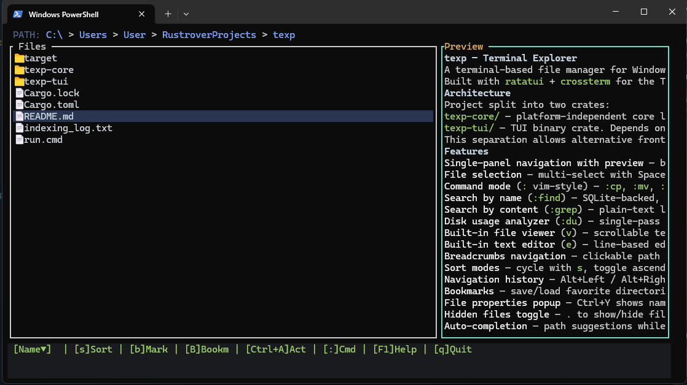
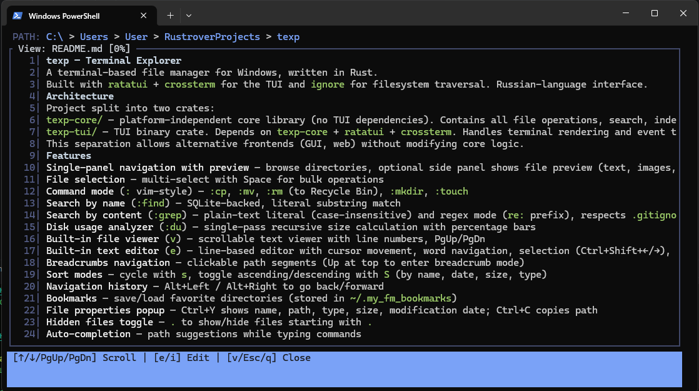

# texp — Terminal Explorer

A terminal-based file manager for Windows, written in Rust.

Built with `ratatui` + `crossterm` for the TUI and `ignore` for filesystem traversal. Russian-language interface.

## Screenshots




## Architecture

Project split into two crates:

- **`texp-core/`** — platform-independent core library (no TUI dependencies). Contains all file operations, search, indexing (ART tree), editor logic, disk usage analysis, and configuration loading.
- **`texp-tui/`** — TUI binary crate. Depends on `texp-core` + `ratatui` + `crossterm`. Handles terminal rendering and event translation only.

This separation allows alternative frontends (GUI, web) without modifying core logic.

## Features

- **Single-panel navigation with preview** — browse directories; the side panel shows a depth-2 directory tree for folders, or file preview (text, images, PDF, Markdown)
- **File selection** — multi-select with Space for bulk operations
- **Command mode** (`:` vim-style) — `:cp`, `:mv`, `:rm` (to Recycle Bin), `:mkdir`, `:touch`
- **Search by name** (`:find`) — SQLite-backed, literal substring match
- **Search by content** (`:grep`) — plain-text literal (case-insensitive) and regex mode (`re:` prefix), respects `.gitignore` + skip dirs/files
- **Disk usage analyzer** (`:du`) — single-pass recursive size calculation with percentage bars
- **Built-in file viewer** (`v`) — scrollable text viewer with line numbers, PgUp/PgDn
- **Built-in text editor** (`e`) — line-based editor with cursor movement, word navigation, selection (Ctrl+Shift+←/→), cut/copy (Ctrl+X/C), Ctrl+S save, auto-save on Esc
- **Breadcrumbs navigation** — clickable path segments (Up at top to enter breadcrumb mode)
- **Sort modes** — cycle with `s`, toggle ascending/descending with `S` (by name, date, size, type)
- **Navigation history** — Alt+Left / Alt+Right to go back/forward
- **Bookmarks** — save/load favorite directories (stored in `~/.my_fm_bookmarks`)
- **File properties popup** — Ctrl+Y shows name, path, type, size, modification date; Ctrl+C copies path
- **Hidden files toggle** — `.` to show/hide files starting with `.`
- **Command snippets** (`:` vim-style) — Tab applies a suggested base command while typing
- **Extensible suggestions** — `SuggestionProvider` trait in `texp-core/src/suggestions.rs`; plug in external tools like `fd`/`rg` as providers
- **Markdown rendering** — styled preview (headings, code, links, lists) in preview panel and viewer
- **PDF preview** — extracts text from first 5 pages with LRU caching
- **Exit auto-save** — on `q`/`:q` with unsaved editor changes, auto-saves and shows progress bar before exiting
- **Customizable config** — TOML file at `<config>/texp/config.toml` or `./texp.toml`
- **CLI argument** — `texp [path]` to start in a specific directory
- **Pictures preview** -- texp use 'kitty protocol' for showing pictures on preview block
## Installation

### Requirements

- **Rust toolchain** (edition 2024) — install from [rustup.rs](https://rustup.rs/)
- **fd** (optional) — instant `:find` and path suggestions; without it the built-in ART index is used

### Build & Install

```sh
cd texp

# Option A — install directly (recommended)
cargo install --path .

# Option B — just build
cargo build --release

# The binary will be at:
#   target/release/texp.exe  (via workspace root)
#   texp-tui/target/release/texp.exe  (via texp-tui crate)
```

After install, the binary is in `~/.cargo/bin/texp.exe`. Make sure that directory is in your `PATH`.

## Usage

```sh
texp [path]
```

Navigate with arrow keys. Press `:` to enter command mode. Press `q` or `Esc` to quit.

### Modes

| Mode | Description |
|---|---|
| **Normal** | File list navigation, selection, bookmarks |
| **Command** | `:` prompt — type commands with autocomplete |
| **Search** | Results from `:find` — navigate with arrows, Enter to open |
| **Breadcrumbs** | Clickable path segments — Left/Right/Enter |
| **Bookmarks** | Saved directories overlay — Enter to jump, `d` to delete |
| **GrepResults** | Content search results — Enter to open file at match line |
| **DiskUsage** | `:du` output — Enter to drill into folder |
| **Viewer** | Scrollable file viewer with line numbers — PgUp/PgDn, `e`/`i` to edit |
| **Editor** | Text editor with line numbers — Ctrl+S save, Ctrl+X/C cut/copy, Esc auto-save & exit |
| **ConfirmDelete** | Confirmation dialog — `y` to confirm, `n`/Esc to cancel |
| **FileInfo** | File properties popup — Ctrl+C copy path, Esc/q close |

### Keybindings

| Key | Mode | Action |
|---|---|---|
| `↑` / `↓` | Normal | Move cursor |
| `Enter` | Normal | Enter directory / open file |
| `Backspace` | Normal | Go to parent directory / delete filter char |
| `Space` | Normal | Toggle file selection |
| `b` | Normal | Toggle bookmark for current file/dir |
| `B` | Normal | Show bookmarks popup |
| `s` | Normal | Cycle sort mode (name, date, size, type) |
| `S` | Normal | Toggle sort order (ascending/descending) |
| `.` | Normal | Toggle hidden files |
| `p` | Normal | Toggle preview panel |
| `v` | Normal | Open file viewer |
| `:` | Normal | Enter command mode |
| `q` | Normal | Quit (auto-saves modified files first) |
| `Ctrl+Y` | Normal | Show file properties popup |
| `Ctrl+B` | Any | Jump to breadcrumbs navigation |
| `Alt+Left` / `Alt+Right` | Normal | Navigate back/forward in history |
| `Esc` | Command | Exit command mode |
| `Enter` | Command | Execute command |
| `Enter` | Command | Substitute highlighted snippet / execute command |
| `Tab` | Command | Apply selected command snippet |
| `↑` / `↓` | Command | Cycle command snippets / history |
| `PgUp` / `PgDn` | Viewer | Scroll up/down |
| `e` / `i` | Viewer | Open editor |
| `↑↓←→` | Editor | Move cursor |
| `Ctrl+←` / `Ctrl+→` | Editor | Word left/right |
| `Ctrl+Shift+←` / `Ctrl+Shift+→` | Editor | Select word |
| `Ctrl+S` | Editor | Save file |
| `Ctrl+X` | Editor | Cut selection to clipboard |
| `Ctrl+C` | Editor | Copy selection to clipboard |
| `Esc` | Editor | Auto-save and exit |
| `Ctrl+C` | FileInfo | Copy file path to clipboard |
| `Esc` / `q` | FileInfo | Close popup |
| `y` / `n` | ConfirmDelete | Confirm / cancel deletion |
| `d` | Bookmarks | Delete selected bookmark |
| `Esc` | Search/GrepResults/DiskUsage/Breadcrumbs | Return to Normal |

### Commands (:)

| Command                        | Description                                                              |
|--------------------------------|--------------------------------------------------------------------------|
| `:cd <path>`                   | Change directory                                                         |
| `:cp <dest>`                   | Copy selected file(s) to destination                                     |
| `:mv <dest>`                   | Move selected file(s) to destination                                     |
| `:rm`                          | Delete selected file(s) to Recycle Bin                                   |
| `:mkdir <name>`                | Create directory                                                         |
| `:touch <name>`                | Create empty file                                                        |
| `:find <name>`                 | Search files by name (fd, fallback to ART index)                         |
| `:grep <query>`                | Case-insensitive literal content search                                  |
| `:grep re:<pattern>`           | Regex content search                                                     |
| `:du`                          | Analyze disk usage of current directory                                  |
| `:index`                       | Rebuild the file index from current directory                            |
| `:q`                           | Quit (auto-saves modified files first)                                   |

## Configuration

Create `texp.toml` in the current directory or `<config>/texp/config.toml`:

```toml
[general]
bookmarks_file = "C:/Users/User/.my_fm_bookmarks"
db_path = "C:/Users/User/texp_files.db"
preview_visible = true

[indexing]
skip_dirs = ["C:\\Windows", "node_modules", "target", ".git"]
skip_files = ["Cargo.lock", "package-lock.json"]
batch_size = 500
```

- `skip_dirs` — directories to skip in indexing and `:grep` (matched case-insensitively by substring)
- `skip_files` — filenames to skip in `:grep` (matched case-insensitively by exact name)

## Build

```sh
cargo build --release
```

### Dependencies

#### texp-core (library)

| Crate | Version | Purpose |
|---|---|---|
| ignore | 0.4.26 | `.gitignore`-aware walking |
| regex | 1.12.4 | Regular expressions for grep |
| lopdf | 0.34 | PDF text extraction for preview |
| trash | 5.2.6 | Safe delete (Recycle Bin) |
| smallvec | 1.15 | Small vector optimization (ART tree) |
| dirs | 6.0.0 | Platform-standard directories |
| arboard | 3.2 | Clipboard access |
| serde | 1 | Configuration deserialization |
| toml | 0.8 | TOML config parsing |
| winreg | 0.52 | Windows Registry (shell verbs) |

#### texp-tui (binary)

| Crate | Version | Purpose |
|---|---|---|
| ratatui | 0.30.1 | Terminal UI framework |
| crossterm | 0.29.0 | Terminal backend |
| pulldown-cmark | 0.13.4 | Markdown → styled ratatui lines |
| serde | 1 | Configuration deserialization |
| toml | 0.8 | TOML config parsing |
| dirs | 6.0.0 | Platform-standard directories |
